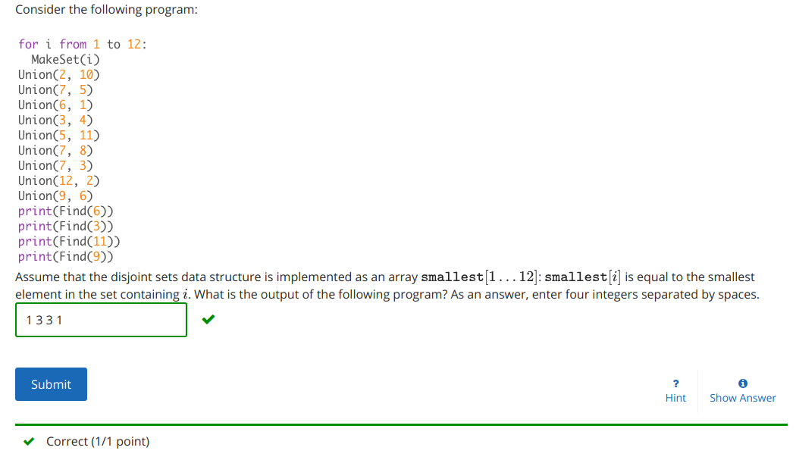
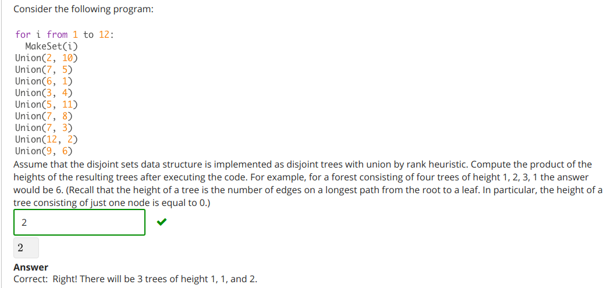
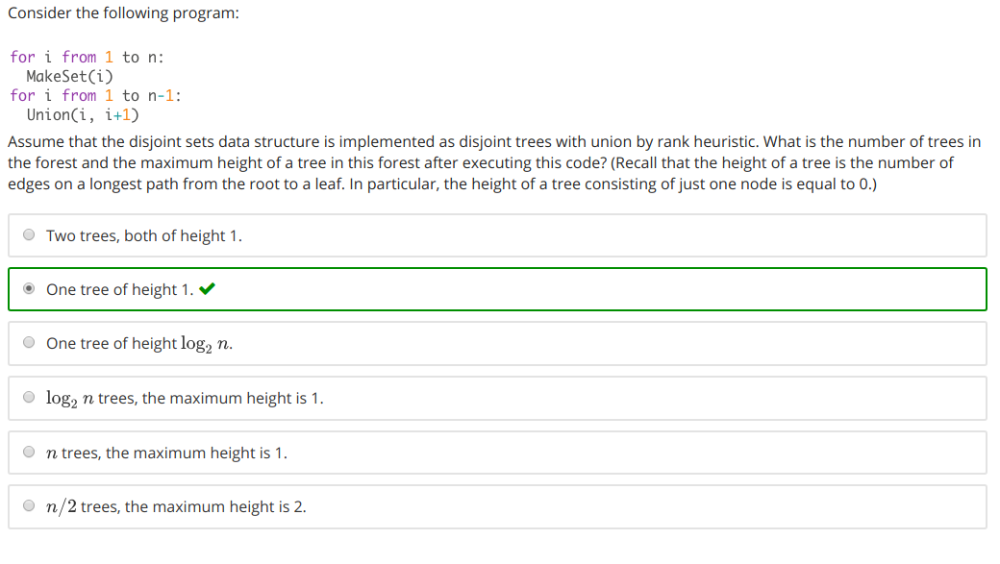

# Q1

## Sets before Unions:
- `{1}`
- `{2}`
- `{3}`
- `{4}`
- `{5}`
- `{6}`
- `{7}`
- `{8}`
- `{9}`
- `{10}`
- `{11}`
- `{12}`

# Sets after Unions:
1. `{1, 6, 9}`
2. `{2, 10, 12}`
3. `{3, 4, 5, 7, 8, 11}`

## Answer:
`1 3 3 1`

-------------

# Q2

# Sets before Unions:
- `{1}`
- `{2}`
- `{3}`
- `{4}`
- `{5}`
- `{6}`
- `{7}`
- `{8}`
- `{9}`
- `{10}`
- `{11}`
- `{12}`

# Sets after Unions:

1. `{1, {6}, {9}}`
2. `{2, {10}, {12}}`
3. `{5, {7}, {11}, {8}, {3, {4}}}`

Just count all the cascading `{` and subtract one.
1. `1`
2. `1`
3. `2`

# Answer
`1*1*2 = 2`

-----------------------
#Q3

# Example 
let n = 5
- `{1}`
- `{2}`
- `{3}`
- `{4}`
- `{5}`

`
{
	1, 
	{2}, 
	{3}, 
	{4}, 
	{5}
}
`

Height = 1

Amount = 1

#  Answer
`One tree of height 1. correct`

# Q4

